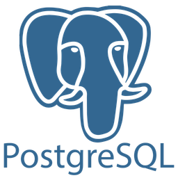
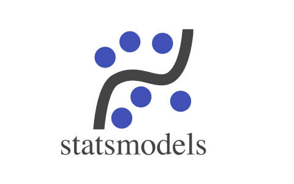
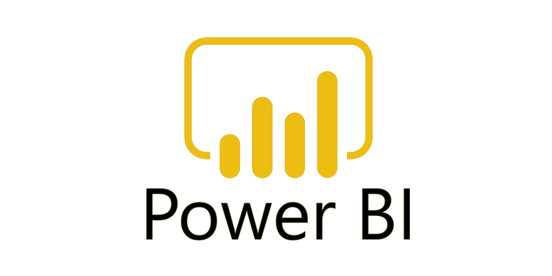

# Hi there, I'm Hasan, PhD 👋
Data analyst | Python & SQL | Visualization & Analytics

Connect with Me:

### Languages & Tools
 &nbsp;
 &nbsp;
 &nbsp;
 &nbsp;
 &nbsp;
 &nbsp;
 &nbsp;
 &nbsp;
 &nbsp;
&nbsp;

