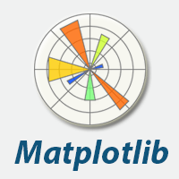
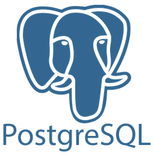
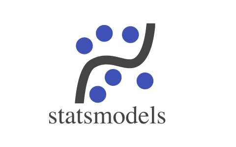
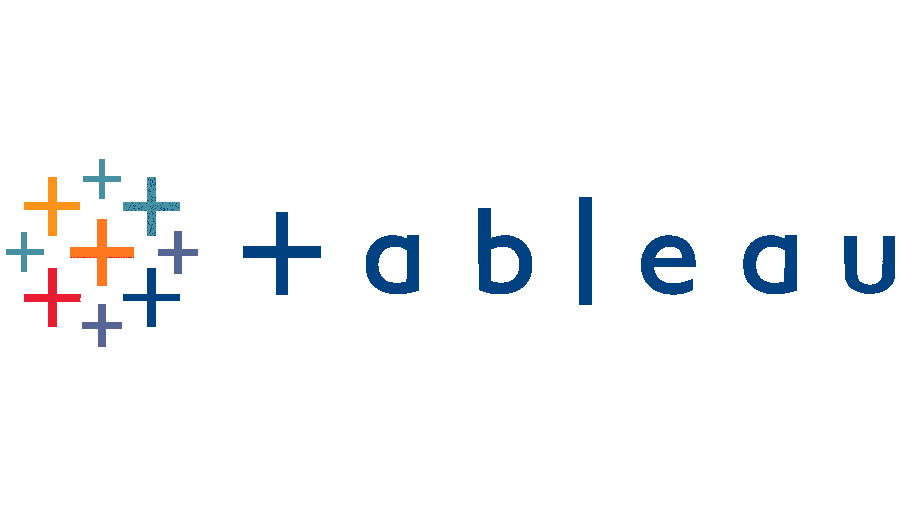
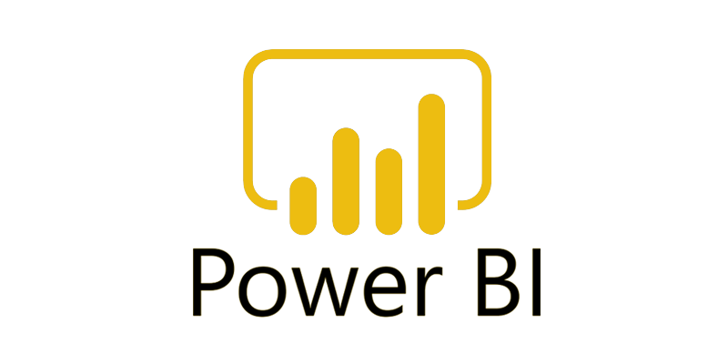

# Hi there, I'm Hasan, PhD 👋
Data analyst | Python & SQL | Visualization & Analytics

Connect with me: <a href="https://www.linkedin.com/in/hasan-atrash-657b0413a">LinkedIn</a> 
[YouTube](https://youtube.com/@Hasan-Atrash) 🧠

### Languages & Tools

 &nbsp;
 &nbsp;
 &nbsp;
 &nbsp;
 &nbsp;
 &nbsp;
 &nbsp;
 &nbsp;
&nbsp;
 

